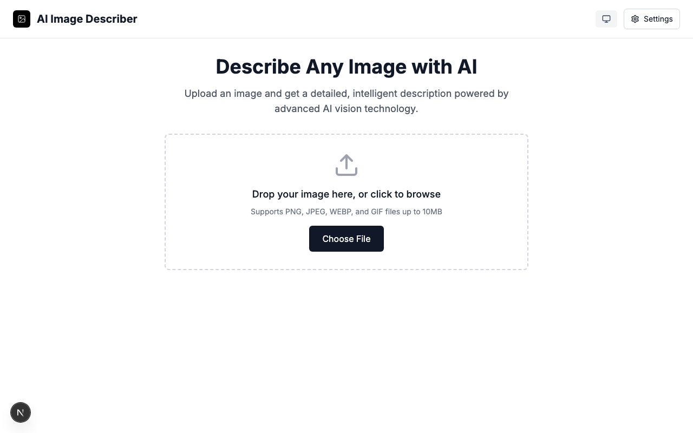
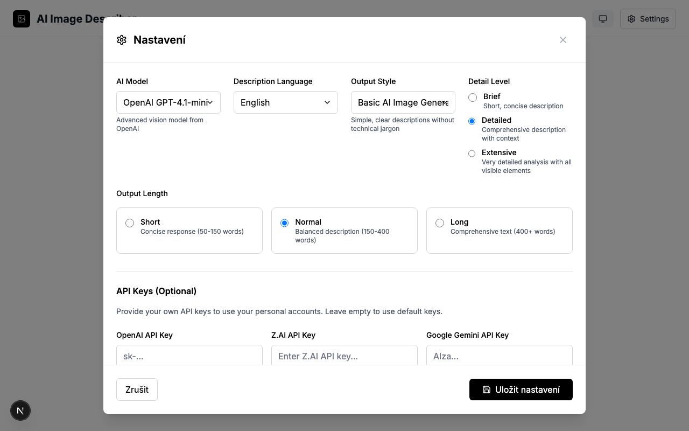

# Image Description Analyzer - Next.js

Aplikace pro analýzu a popis obrázků pomocí různých AI modelů (OpenAI, Gemini).

## 🚀 Rychlý start

### 1. Instalace závislostí

```bash
cd web-nextjs
npm install
# nebo
pnpm install
```

### 2. Nastavení environment variables

Zkopírujte `.env.local` a nastavte vaše API klíče:

```bash
cp .env.local .env.local.example
```

Upravte `.env.local`:

```env
# API Keys
OPENAI_API_KEY="sk-your-openai-api-key"
GEMINI_API_KEY="your-gemini-api-key"

# Database
DATABASE_URL="sqlite:./data/database.db"

# App Settings
NEXT_PUBLIC_APP_URL="http://localhost:4000"
```

### 3. Spuštění aplikace

```bash
npm run dev
# nebo
pnpm dev
```

Aplikace bude dostupná na [http://localhost:4000](http://localhost:4000).

## 🏗️ Architektura

### Frontend
- **Next.js 15** - React framework s App Router
- **TypeScript** - Type safety
- **Tailwind CSS** - Styling
- **Lucide React** - Ikony

### Backend
- **Next.js API Routes** - Server-side API
- **SQLite** - Databáze pro user settings
- **Better SQLite3** - SQLite driver

### AI Integrace
- **OpenAI GPT-4o-mini** - Vision model
- **Google Gemini** - Multimodal AI
- **Podpora pro custom API klíče**

## 📁 Struktura projektu

```
web-nextjs/
├── src/
│   ├── app/
│   │   ├── api/           # API routes
│   │   │   ├── analyze-image/
│   │   │   ├── settings/
│   │   │   └── upload/
│   │   ├── globals.css
│   │   ├── layout.tsx
│   │   └── page.tsx       # Hlavní stránka
│   ├── components/        # React komponenty
│   ├── hooks/            # Custom hooks
│   └── lib/              # Utility funkce
├── data/                 # SQLite databáze
├── public/              # Statické soubory
└── package.json
```

## 🔧 API Endpointy

### `POST /api/analyze-image`
Analýza obrázku pomocí AI modelu.

**Request:**
```json
{
  "imageUrl": "data:image/jpeg;base64,...",
  "settings": {
    "model": "openai",
    "language": "english",
    "detailLevel": "detailed"
  }
}
```

**Response:**
```json
{
  "success": true,
  # Image Description Analyzer

  A modern web application (Next.js + TypeScript + Tailwind) for analyzing images and generating AI-powered descriptions, tags and safety insights.

      

  Short summary:

  - Upload images (drag & drop or file picker)
  - Generate AI descriptions, tags and a simple safety score
  - Store user settings and API keys locally
  - Small persisted history using SQLite

  ## Screenshots

  Upload and analyze

  

  Settings & API key

  

  Analysis result

  

  ## Quickstart

  Requirements:
  - Node.js 18+ (recommended)
  - pnpm (project uses pnpm lockfile, npm/yarn also supported)

  Clone and run locally:

  ```bash
  git clone https://github.com/nykadamec/web-nextjs.git
  cd web-nextjs
  pnpm install
  pnpm dev
  ```

  The dev server runs on port 4000 by default (see `package.json` scripts).

  Available scripts (package.json):

  - `pnpm dev` — start dev server (Next.js) on port 4000
  - `pnpm build` — build for production
  - `pnpm start` — start production server on port 4000
  - `pnpm lint` — run linter
  - `pnpm typecheck` — run TypeScript checks

  Generate screenshots (optional):

  ```bash
  pnpm install
  pnpm exec playwright install --with-deps   # first run only
  pnpm screenshots
  ```

  ## Configuration

  - API keys and settings are managed in-app and persist to a local SQLite DB (`data/database.db`).
  - See `docs/api-key-management.md` for details about setting provider keys.

  If you prefer environment variables, add a `.env.local` in the project root and configure keys there.

  ## Project structure

  - `src/app` — Next.js app routes and pages
  - `src/components` — React components
  - `src/hooks` — custom hooks
  - `src/lib` — utilities and database access
  - `data/` — local SQLite database

  ## Tests

  A small unit test exists under `src/lib/__tests__/`.

  Run tests or type checks as configured. If you don't have a test runner installed, run `pnpm typecheck` to validate types.

  ## Contributing

  Contributions are welcome. Please open an issue to discuss larger changes. For code contributions, create a branch, add tests for new behavior, and submit a pull request.

  ## Privacy & Security

  Depending on configuration the app may send images or derived text to third-party AI providers. Do not upload sensitive content unless you trust the configured provider.

  ## License

  MIT. Add a `LICENSE` file to the repository if you want an explicit license artifact.

  ---

  Would you like me to:

  - generate real screenshots from a running dev server (uses Playwright) and add them to `docs/screenshots/` via `pnpm screenshots`?
  - generate a small `LICENSE` file (MIT)?
  - create a simple GitHub Actions workflow for CI (typecheck + lint)?

  Tell me which follow-up you prefer and I will add it.
